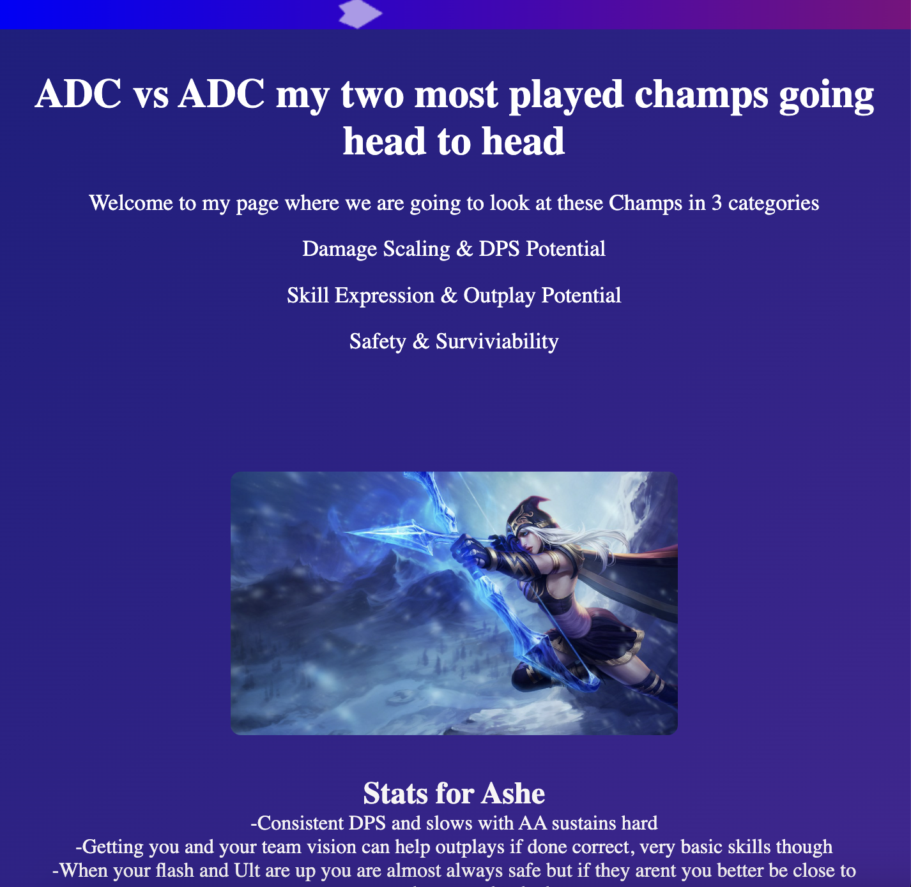

# ADC vs ADC – League of Legends Showdown

Welcome to my front-end project where I compare two of my most-played League of Legends ADC champions: **Ashe** and **Caitlyn**.

🕹️ **Live Demo:**  
https://tcwilkinson8.github.io/HTML_C_C_2/

---

## 🔍 What’s Inside

- 🎯 Hero section introducing the matchup
- 📊 Champ stats on responsiveness, damage, and survivability
- 🎨 Custom canvas animation banner
- 💡 Highlight facts with headshot visuals
- 📱 Responsive layout that stacks gracefully on mobile

---

## 🚀 How I Built It

- **HTML5 + CSS3** with Flexbox and media queries
- Vanilla **JavaScript** for canvas-based animation
- Fully **responsive**, hosted with **GitHub Pages**

---

## ⚙️ Future Improvements

- Add animations between sections (scroll or fade)
- Explore using champions' abilities as icons
- Expand to include more ADCs (Jhin? Kai'Sa?)

---

## 🎮 Why I Made This

As a League player and aspiring backend developer, I wanted to build something visually expressive that blends my interests in games, UI design, and coding. This project helped sharpen my responsive layout chops while keeping things fun and creative.

---

> Crafted with caffeine and crit chance by Conor Wilkinson 😄

